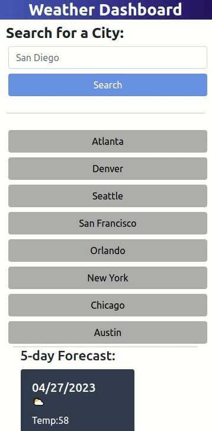

# Weather Dashboard

## Description

I wanted to create a solution that allows for an easy weather search. I created this with each major city and a search bar. It allows for easy switching between cities. It has allowed me to work with different frameworks and APIs, for example DayJS, Bootstrap, and OpenWeatherMaps and to learn how to work with these frameworks.

